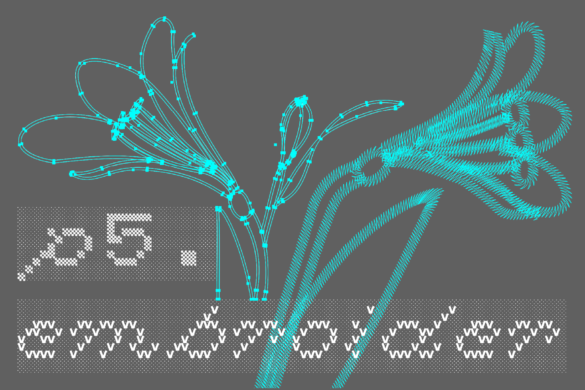
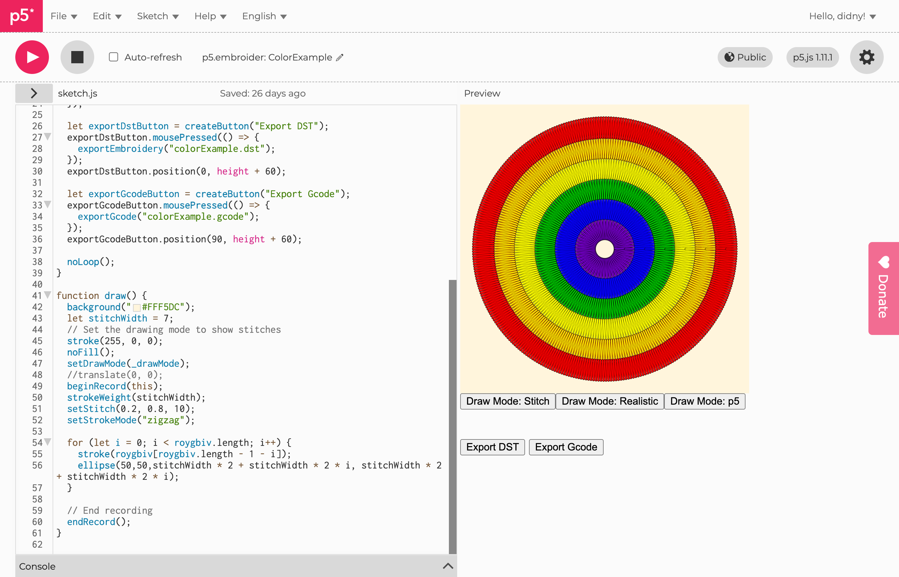

# p5.embroider




 ## A p5.js Library for Digital Embroidery Pattern Creation

[**p5.embroider.js**](https://github.com/nkymut/p5.embroider) is a p5.js library for creating digital embroidery patterns.<br />

**Note:** This library is currently in early Alpha stage. Expect frequent and significant breaking changes. Please use with caution.


Version 0.3.0, September 02, 2026 • by Yuta Nakayama ([nkymut](https://github.com/nkymut))


## Requirements

p5.embroider 0.3 and later require **p5.js 2.x**. Load p5.js first, then
p5.embroider.

Coming from an older sketch? See the **[Migration guide](./MIGRATION.md)**. 

p5.embroider 0.2.1 is the last release for
p5.js 1.x.

## Installation
To use p5.embroider in your project, include the library in your HTML file:

### CDNs

```html
<script src="https://cdn.jsdelivr.net/npm/p5@2.3.2/lib/p5.js"></script>
<script src="https://unpkg.com/p5.embroider/lib/p5.embroider.js"></script>
```

### GitHub Pages

```html
<script src="https://cdn.jsdelivr.net/npm/p5@2.3.2/lib/p5.js"></script>
<script src="https://nkymut.github.io/p5.embroider/lib/p5.embroider.js"></script>
```

### p5.js 1.x (frozen)

p5.embroider 0.2.1 is kept under [`v1/`](./v1/) for sketches still on p5.js 1.x.
It is not maintained.

```html
<script src="https://cdn.jsdelivr.net/npm/p5@1.11.1/lib/p5.js"></script>
<script src="https://nkymut.github.io/p5.embroider/v1/p5.embroider.js"></script>
```


## Examples

[editor.p5.js](https://editor.p5js.org/didny/sketches/PR9KKzCMe)   




```jsx
let _drawMode = "stitch";

let roygbiv = ["red", "orange", "yellow", "green", "blue", "indigo"];

function setup() {
  createCanvas(mmToPixel(150), mmToPixel(150));

  let exportDstButton = createButton("Export DST");
  exportDstButton.mousePressed(() => {
    exportEmbroidery("colorExample.dst");
  });
  exportDstButton.position(0, height + 60);

  noLoop();
}

function draw() {
  background("#FFF5DC");
  let stitchWidth = 8;
  // Set the drawing mode to show stitches
  stroke(255, 0, 0);
  noFill();
  setDrawMode(_drawMode);
  //translate(0, 0);
  beginRecord();
  strokeWeight(stitchWidth);
  setStitch(0.1, 0.5, 0);
  setStrokeMode("zigzag");
  for (let i = 0; i < roygbiv.length; i++) {
    stroke(roygbiv[roygbiv.length - 1 - i]);
    ellipse(75, 75, stitchWidth * 2 + stitchWidth * 2 * i, stitchWidth * 2 + stitchWidth * 2 * i);
  }

  // End recording
  endRecord();
}
```

## Documentation

[Documentation](https://nkymut.github.io/p5.embroider/docs/index.html)

[Migration guide: p5.js 1.x to 2.x](./MIGRATION.md)


## License

This project is licensed under the LGPL v2.1 License - see the [LICENSE](LICENSE) file for details.


## References

p5.plotSvg
[https://github.com/golanlevin/p5.plotSvg](https://github.com/golanlevin/p5.plotSvg)

pyembroidery
[https://github.com/EmbroidePy/pyembroidery](https://github.com/EmbroidePy/pyembroidery)

Ink/Stitch
[https://github.com/inkstitch/inkstitch](https://github.com/inkstitch/inkstitch)

PEmbroider
[https://github.com/CreativeInquiry/PEmbroider](https://github.com/CreativeInquiry/PEmbroider)

stitch.js
[https://github.com/stitchables/stitch.js](https://github.com/stitchables/stitch.js)


